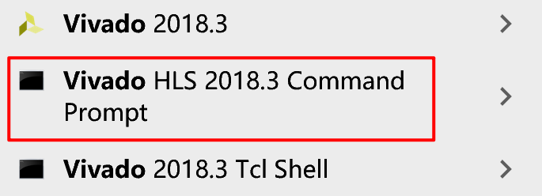
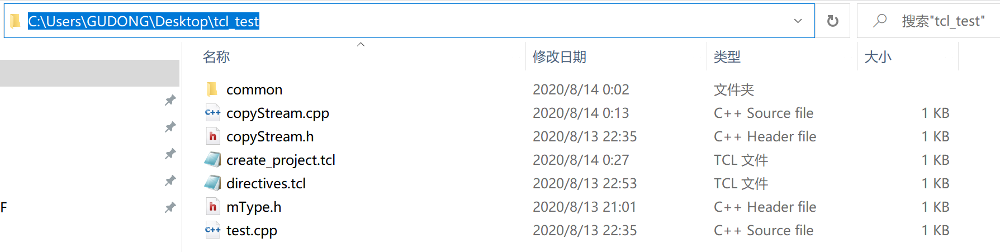
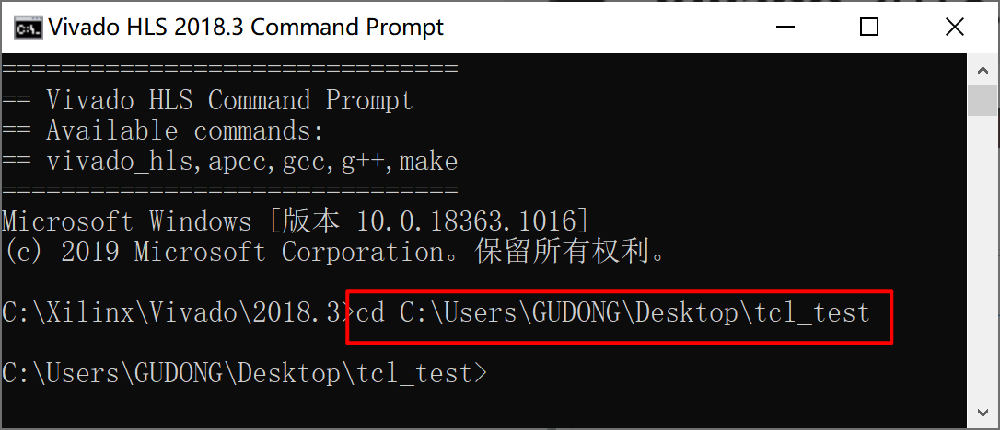
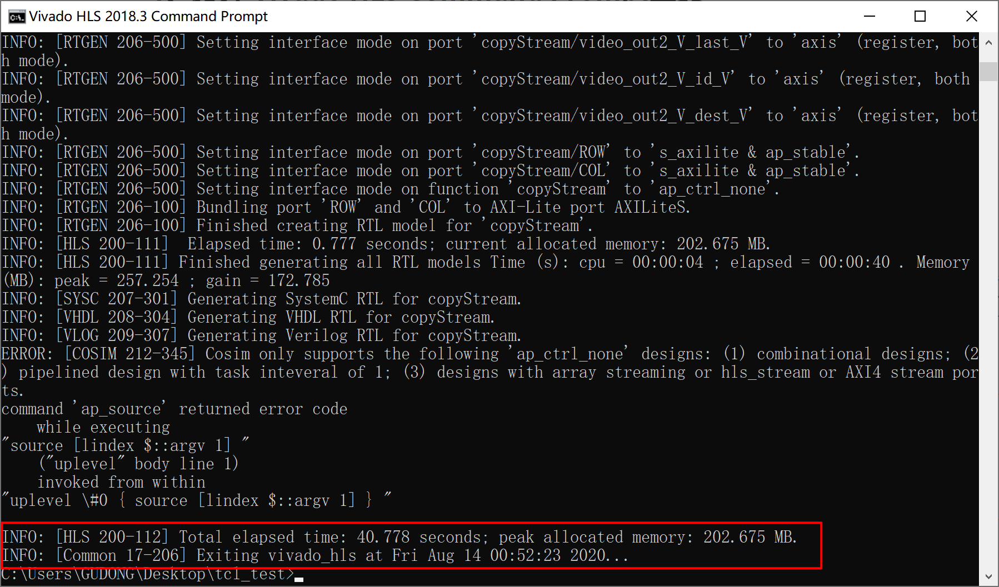

# AXIStreamReplicator_HLS
此模块使用HLS编写，用于复制流对象

## 一、使用**\source\create_project.tcl**复现工程

### 1、打开 Vivado HLS Command Prompt工具

### 2、定位到下载的文件目录。例如文件下载在目录**C:\Users\GUDONG\Desktop\tcl_test**中，如下图所示。

### 3、输入并运行指令：vivado_hls -f create_project.tcl，等出现如下画面。

### 4、输入并运行指令：vivado_hls -p copyStream，Vivado HLS软件将自动启动并打开工程。

### 5、进行C仿真、C\RTL联合仿真（联合仿真需将顶层函数中的ap_ctrl_none指令更换为ap_ctrl_hs,否则报错）